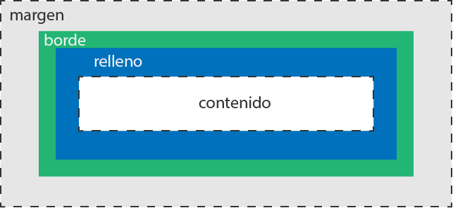

# Box model

El modelo de caja en HTML y CSS es un concepto clave para entender cómo funciona la maquetación de una página web. Se refiere a la forma en que los elementos HTML se representan visualmente en la página.



Cada elemento HTML es una caja, que puede tener un contenido, un borde, un margen, un relleno y una altura y ancho especificados. Estas propiedades se pueden modificar mediante CSS para crear un diseño personalizado y atractivo.

Aquí hay un ejemplo de código HTML que muestra cómo utilizar las propiedades de la caja en CSS para dar estilo a un elemento HTML:

```html
<!DOCTYPE html>
<html>
  <head>
    <style>
      div {
        width: 200px;
        height: 100px;
        border: 2px solid black;
        padding: 10px;
        margin: 10px;
      }
    </style>
  </head>
  <body>
    <div>Contenido de la caja</div>
  </body>
</html>
```

En este ejemplo, se crea una división (div) que se utiliza como contenedor para el contenido. Se especifica un ancho y una altura para la caja, y se agrega un borde negro de 2 píxeles, un relleno de 10 píxeles y un margen de 10 píxeles. Esto produce una caja con contenido que se ve así:

[insertar imagen de box model]

Los conceptos del modelo de caja son fundamentales para crear diseños de páginas web que se vean bien y sean fáciles de usar. Con la comprensión de cómo funcionan las cajas, puedes crear diseños más complejos y personalizados.

## margen automatico

El margen automático es una técnica común en CSS para centrar elementos horizontales dentro de un contenedor. Puedes hacerlo especificando un margen izquierdo y derecho de "auto".

Esto hace que el navegador calcule automáticamente el espacio libre disponible en el contenedor y divide equitativamente ese espacio entre los márgenes izquierdo y derecho. Esto hace que el elemento se centre automáticamente dentro del contenedor.

Aquí hay un ejemplo de código:

```css
.container {
  width: 500px;
  height: 500px;
  background-color: lightgray;
  text-align: center;
}

.center-element {
  width: 200px;
  height: 200px;
  background-color: lightblue;
  margin: 0 auto;
}
```

En este ejemplo, el elemento con la clase "center-element" tiene un ancho y un alto de 200px y se encuentra dentro de un contenedor con la clase "container". Al especificar un margen izquierdo y derecho de "auto", el elemento se centra automáticamente dentro del contenedor.
